# Writeup: 3D Object Detection

## Section 1: Compute Lidar Point-Cloud from Range Image

### Visualize range image channels (ID\_S1\_EX1)

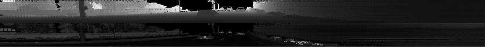

### Visualize lidar point-cloud (ID\_S1\_EX2)

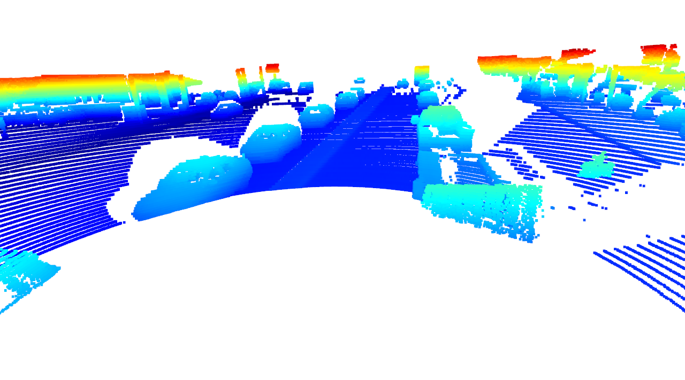

After visualizing the point cloud for a dataset and exploring them in Open3D, we can see a number of examples of vehicles of varying degrees of visibility.

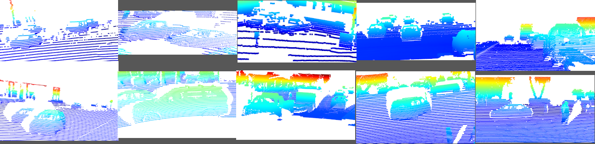

Among these examples, we see vehicles in the path of motion, in front of and behind the lidar sensor.
We also see vehicles parked along the roadway and in parking lots adjacent to the road.
In many of these examples, we can see common features that standout as identifying a vehicle, including their general outline, windows, wheels, and side mirrors.
In some cases, we can see elements as small as radio antennae or interior seats and headrests.
From head-on or behind, it is often easy to identify the side mirrors for vehicles, though in some cases those mirrors amount to only a handful of pixels in resolution.
From closer up or side profile, we can see much more detail, like roof bars or lights.

We can also see some of these same features when inspecting the range image.
Viewing these images with range and intensity shown in different outputs can make elements that are very reflective, like tail light reflectors and license places, very obvious.

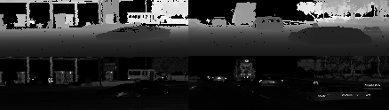

## Section 2: Create Birds-Eye View from Lidar PCL

### Convert sensor coordinates to BEV-map coordinates (ID\_S2\_EX1)

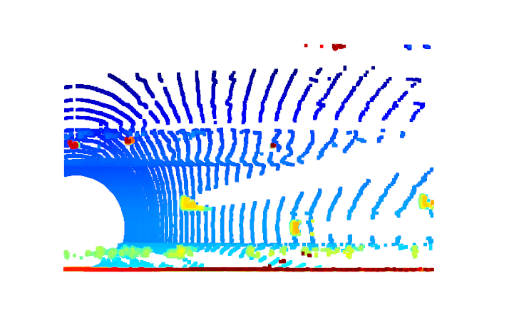

### Compute intensity layer of the BEV map (ID\_S2\_EX2)

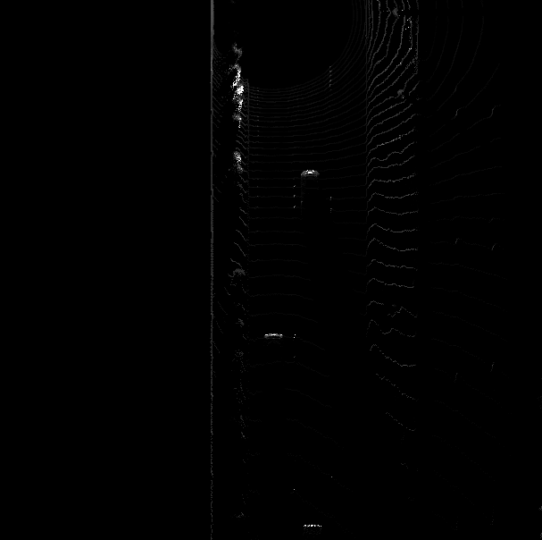

### Compute height layer of the BEV map (ID\_S2\_EX3)

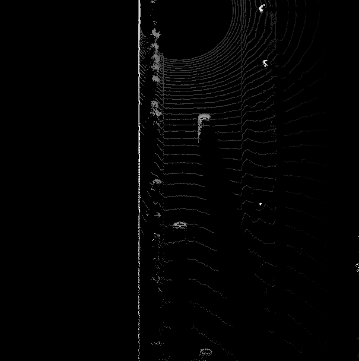

## Section 3: Model-based Object Detection in BEV Image

### Add a second model from a GitHub repo (ID\_S3\_EX1)

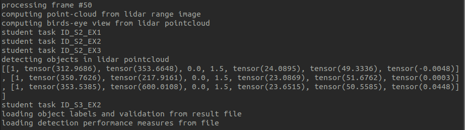

### Extract 3D bounding boxes from model response (ID\_S3\_EX2)

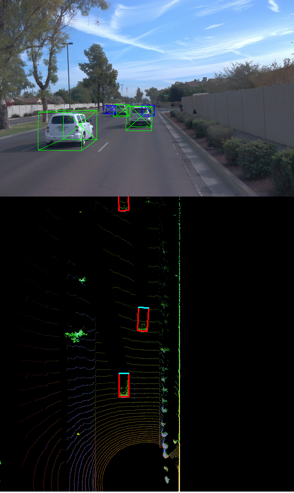

## Section 4: Performance Evaluation for Object Detection

### Compute intersection-over-union between labels and detections (ID\_S4\_EX1)

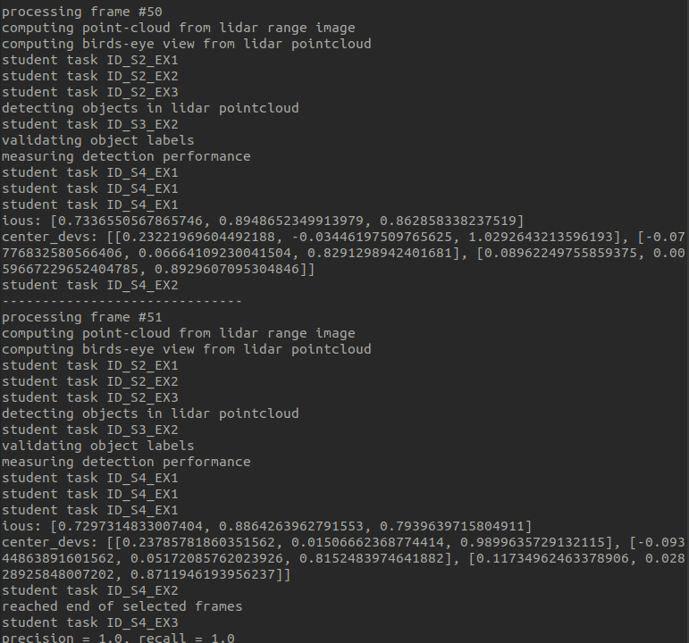

### Compute false-negatives and false-positives (ID\_S4\_EX2)

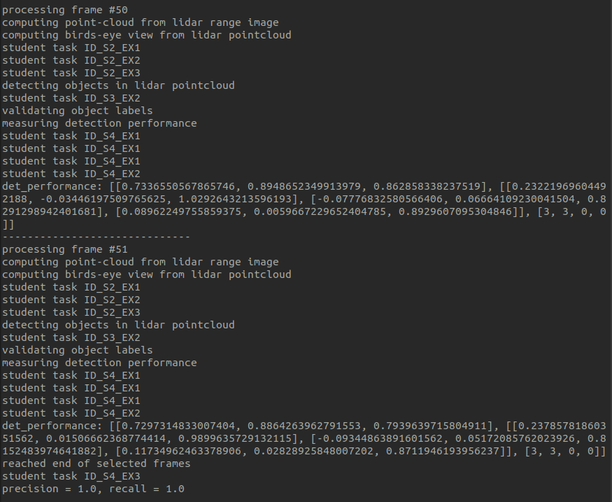

### Compute precision and recall (ID\_S4\_EX3)

`precision = 0.9206349206349206, recall = 0.9477124183006536`

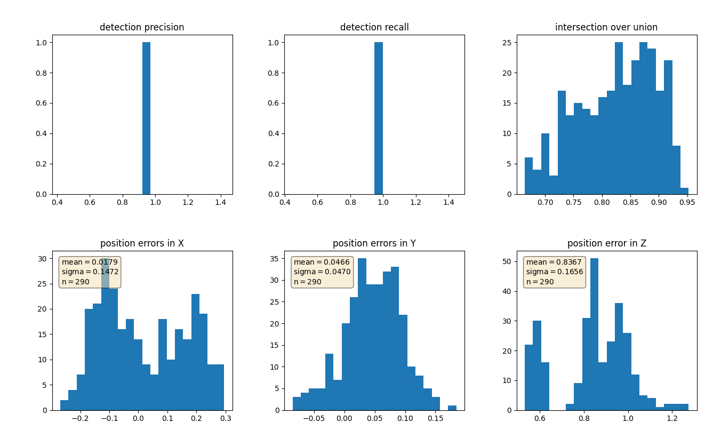

#### Setting `configs_det.use_labels_as_objects = True`

`precision = 1.0, recall = 1.0`

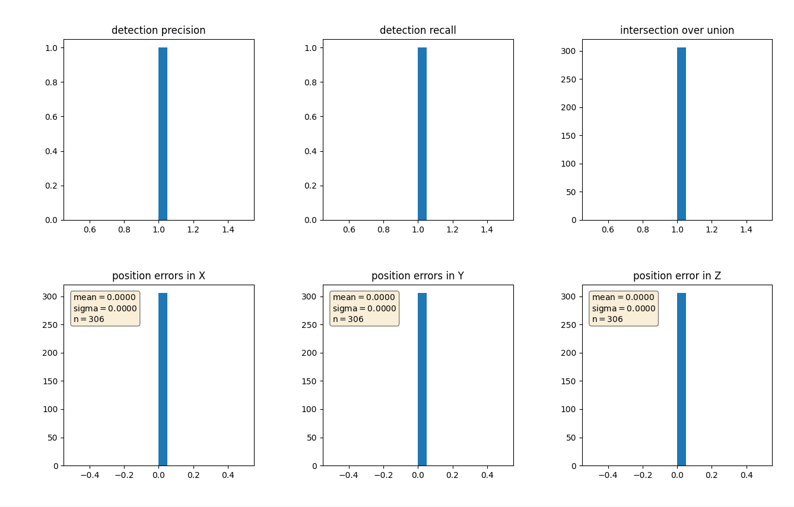
