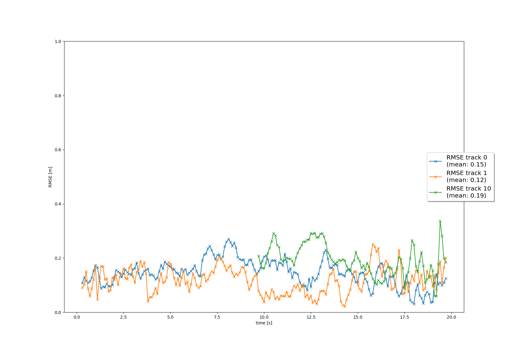

# Writeup: Track 3D-Objects Over Time

## 1. Write a short recap of the four tracking steps and what you implemented there (filter, track management, association, camera fusion). Which results did you achieve? Which part of the project was most difficult for you to complete, and why?

### Step 1: Tracking

In the first step of the project, we implemented the Extended Kalman Filter.
This allowed us to track the single vehicle using only the lidar measurements.
As can be seen below, the mean RMSE result is below the expected 0.35 threshold.
While the tracking was reasonably good, we can improve on this by including measurements from the camera and tuning the parameters.

### Step 2: Track Management

In the second step of the project, we implemented track management.
For each track, we initialized and updated a score and state.
When then kept track of those values over time to decide if and when to delete the track.
As can be seen below, the mean RMSE is high, but still below the expected 0.8 threshold for this step.

### Step 3: Data Association

In the third step of the project, we implemented data association.
For each track and measurement, we associated them by calculating their Mahalanobis distance and associating the nearest measures to their track.
As can be seen in the RMSE plot, we track 3 objects in the scene with a relatively low error.

### Step 4: Sensor Fusion

In the last step of the project, we included measurements from the camera sensor in our fusion.
To do this, we identified if the sensor measurement was within the field-of-view for the sensor.
We then also calculated the non-linear measurement expectation value.
Finally, we initialized the camera measurement objects using the provided parameters.

We can see from our results that the tracking is quite good and that we've removed most instances of clutter.

## 2. Do you see any benefits in camera-lidar fusion compared to lidar-only tracking (in theory and in your concrete results)?

There are clearly benefits to using a fusion approach over relying purely on lidar.
In theory, using redundant sensors can help to overcome the shortcomings of any one sensor type.
We see this in practice by looking at the results we can acheive with a fusion system.
As can be seen from the videos below, we see fewer ghost tracks and more stable tracking of real targets.

### Lidar-only

### Camera-Lidar Fusion

## 3. Which challenges will a sensor fusion system face in real-life scenarios? Did you see any of these challenges in the project?

Associating measurements with tracks can be difficult.
In a situation with many vehicles or other objects to track, the heuristics we use to assign measurements to tracks may break down.
Additionally, in situations where one or the other sensor is failing to detect an object in the scene, that object's tracking may never become confirmed.
There are also situations where one or the other sensor might perform more or less poorly.
For example, cameras may perform poorly at night while lidar might perform poorly in inclement weather.
We didn't see any of these particular situations in our project, but its not hard to imagine these types of situations arising in real-world conditions.

## 4. Can you think of ways to improve your tracking results in the future?

To improve tracking, you could introduce more sensors, like newer types of lidar or forward-facing radar that can infer velocity from the Doppler effect perceived in the returned signal.
Also, any improvements in the accuracy of your sensor perception systems should result in more accurate tracking.
From the perception system, you could also use confidence weights to improve the scoring of tracks.
Improvements to the components of the tracking system, like improving the gating decision or the models used to describe motion would also improve the overall tracking system.

## Combining Mid-Term and Final Projects

In order to see how our complete project works, we've pulled in the lidar object detection system we created in the mid-term.
This system performs worse than the recorded results. It appears that the model we have trained is less adept at identifying the objects in the scene than the recorded results.

We've also updated the lidar measurement noise to match the standard deviation values we found in the mid-term.
This system also doesn't perform as well as the recorded results, but improves upon the RMSE values found after just combining the mid-term with the final project.

